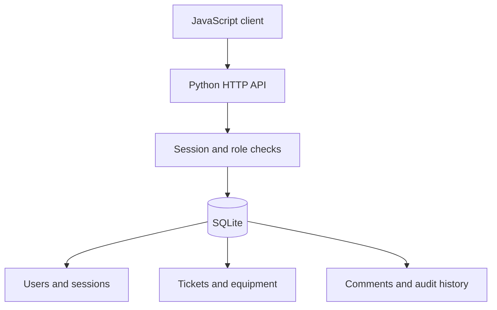

# OpsDesk Pro

**An IT service operations application with a Python API, SQLite database and JavaScript client.**

A larger portfolio project for Ismail Bentayeb combining IT support workflows, application development, relational data modeling and operational reporting. Created with AI assistance; designed to be studied, demonstrated and extended.

## Start in three commands

Requires **Python 3.11 or newer**. No pip packages, Node.js build step, cloud service or API key is needed.

```sh
cd opsdesk-pro
python seed_demo.py
python server.py
```

Open **http://127.0.0.1:8000**. Sign in using one of the **random credentials printed by the seed command**. The seed refuses to overwrite an existing workspace. All demo records are fictional.

On systems where Python uses `python3`, replace `python` in the commands above.

### Start with an empty workspace

```sh
python server.py --create-user
python server.py
```

The interactive command asks for a name, email, password (12+ characters) and role. Repeat it to create more users. Password input is hidden. You can select a different database using the `OPSDESK_DB` environment variable; the default is `data/opsdesk.sqlite3`.

## What is implemented

| Area | Working functionality |
| --- | --- |
| Identity | Login, logout, password hashing, expiring cookie sessions, CSRF tokens |
| Access | Requesters see only their own requests; agents/admins manage all requests |
| Ticket workflow | Creation, status changes, agent assignment and equipment linking |
| Collaboration | Persistent comments and append-only application activity history |
| Concurrency | Version checks reject stale ticket updates rather than overwrite them |
| Inventory | Register equipment with unique tags, department and lifecycle state |
| Service targets | Priority-based calendar-hour deadlines and overdue counts |
| Reporting | Dashboard KPIs, seven-day intake, workload by priority and CSV export |
| Search | Combined title/ID search and status filtering |
| Persistence | Relational SQLite database with foreign keys, constraints and indexes |

Admins and agents currently have identical service-desk permissions. User provisioning is a local CLI operation, not a web administration screen. Equipment can be registered, viewed and linked; equipment editing/deletion is not implemented.

## Demo walkthrough

1. Sign in as the requester and create a **High** priority request.
2. Sign out and sign in as the agent.
3. Open the request, assign the agent and link an asset.
4. Change the status to **In Progress**, add a diagnostic comment, then resolve it.
5. Review activity history and updated reporting.
6. Export the current filtered ticket list as CSV.
7. Sign in as the requester to see the comments and resolution. Other requesters cannot access this ticket.

## Business rules

Resolution targets: Critical **4h**, High **24h**, Medium **72h**, Low **168h** from creation. They use elapsed calendar hours, not working days, and do not pause. Reopening preserves the original due date. Average resolution time covers currently resolved tickets from creation to their latest resolution; it is not first-response time. Dates are stored in UTC; the UI displays local times and the intake chart groups by UTC day.

## Architecture



- `server.py`: HTTP routes, validation, authorization and database transactions.
- `schema.sql`: six relational tables, constraints and indexes.
- `static/`: responsive client, forms, details dialogs and analytics.
- `seed_demo.py`: fictional data and one-time random demonstration passwords.
- `tests/test_api.py`: integration tests against an actual ephemeral HTTP server and database.
- `docs/API.md`: endpoints, request examples and permission model.

## Test

```sh
python -m unittest discover -s tests -v
```

The suite tests real HTTP requests, role restrictions, object-level access, CSRF checks, stale updates, transaction rollback, comments, duplicate assets, filtered CSV exports, analytics, logout and expiration. Test credentials exist only in a temporary database. Browser visual verification was not performed in the build environment.

## Deployment scope

The included standard-library HTTP server binds to **127.0.0.1** and is intended for local demos. **GitHub Pages cannot run the Python backend.** The original static SupportDesk at the repository root remains independently usable on Pages.

Before public deployment, move the API behind a production server/TLS proxy, add Secure cookies, login rate limiting, origin/host validation, migrations, structured operational logging and a backup/recovery process. There is no password reset, MFA, file upload, notification delivery, pagination or external monitoring integration. The audit log is append-only through this API, not tamper-proof against database administrators.

## Portfolio positioning

“Built a local full-stack IT service desk with a Python API and SQLite, including role-based ticket access, equipment assignment, collaboration, optimistic concurrency and operational analytics.”

This demonstrates application design and IT workflow modeling; it does not imply production deployment or use by an employer.
