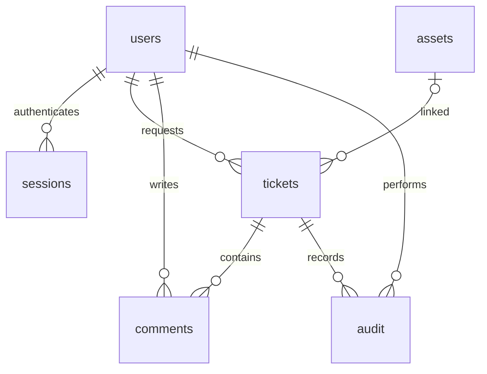

# HTTP API

All endpoints use `/api/`. JSON mutations require `Content-Type: application/json`. All mutations except login require the `X-CSRF-Token` value returned by `/api/me`. Authentication uses the `session` HttpOnly, SameSite=Strict cookie with an eight-hour lifetime.

| Method | Path | Access | Purpose |
| --- | --- | --- | --- |
| POST | `/login` | Anonymous | Email/password sign-in |
| GET | `/me` | Signed in | Current user and CSRF token |
| POST | `/logout` | Signed in | Invalidate current session |
| GET | `/users` | Agent/admin | List assignable staff (no password hashes) |
| GET, POST | `/assets` | Agent/admin | List or register equipment |
| GET | `/tickets?q=&status=` | Signed in | Scoped search/filter |
| POST | `/tickets` | Signed in | Create a request owned by the current user |
| GET | `/tickets/{id}` | Owner or staff | Details, comments and activity |
| PATCH | `/tickets/{id}` | Agent/admin | Change status, assignment and linked asset |
| POST | `/tickets/{id}/comments` | Owner or staff | Add a comment |
| GET | `/analytics` | Signed in | Scoped KPI and chart data |
| GET | `/report.csv?q=&status=` | Signed in | Scoped, filtered CSV |

### Create ticket

```json
{"title":"Printer offline","description":"Reception cannot print.","priority":"High"}
```

Returns HTTP 201 with `{"id": 1}`. Priority must be Low, Medium, High or Critical.

### Update ticket

```json
{"status":"In Progress","assignee_id":2,"asset_id":1,"version":1}
```

This request supplies all editable fields. Use `null` to clear assignment/asset. Get the latest `version` from ticket details; a stale version returns 409. Status must be Open, In Progress or Resolved. Requester identity and priority are immutable after creation in this version.

### Register equipment

```json
{"tag":"PC-042","name":"Dell workstation","department":"Finance","state":"Active"}
```

State must be Active, Maintenance or Retired. Asset tags are unique and case-sensitive.

### Error handling

Errors return `{"error":"Readable message"}`. Codes: 400 invalid input, 401 missing/expired session, 403 role/CSRF failure, 404 missing or inaccessible ticket, 409 stale edit/duplicate/foreign-key conflict, 413 oversized body, 415 wrong media type. Maximum request body is 32 KiB. SQL values use parameterized statements. Client rendering escapes text; CSV cells beginning with formula characters are prefixed with an apostrophe.

### Schema relationships



Each request uses one SQLite connection and transaction. Database files, session tokens and actual demonstration credentials must remain local and are excluded from Git.
